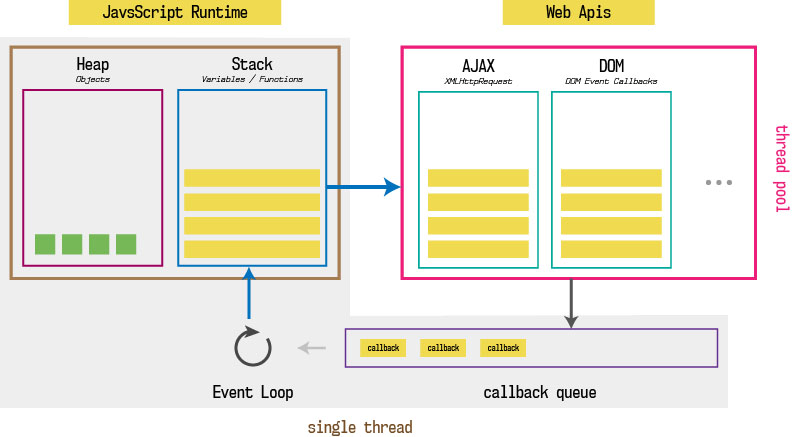

Javascript is a single-threaded language. this means it has one *call stack* and one *memory heap*. As expected, it executes code in order and must finish executing a piece code before moving onto the next. It's synchronous, but that would make it very harmful. For example, if a function takes awhile to execute or has to wait on something, it freezes everything up in the meanwhile.

## _*So, How do you get asynchronous code with Javascript then?*_

The answer is that JavaScript runs within a browser and browsers do a lot more than just execute code. In fact, `there are four distinct parts of the browser` to consider:

1. **JavaScript runtime engine**
2. **Web APIs** provided by the browser like the `DOM`, `setTimeout`, etc.
3. **a callback queue** for events with callbacks like onClick and onLoad
4. **an event loop**

This visual from [Philip Roberts’s fantastic talk on the Event Loop](https://youtu.be/8aGhZQkoFbQ) illustrates the point nicely:

**_JavaScript runtime  engine_** is what executes our code and each major browser has a slightly different engine under the hood.

**_Web APIs_** are provided to us by the browser and include methods like `setTimeout()`, `setInterval()`.... 

*The *call stack* recognizes functions of the Web API and hands them off to be handled by the browser. Once those tasks are finished by the browser, they return and are pushed onto the stack as a callback.*

If you simply type `window` in your console you can scroll through the long, long list of APIs included by default.

_These APIs are run independently, in a separate process, by the browser. **This is how asynchronous JavaScript happens!!!** It’s not that JavaScript itself is doing multiple things at once; instead *the browser can run multiple different processes* for us._

[Here](http://latentflip.com/loupe/) is a really good site that slows the process of asynchronous and show what happen. 
