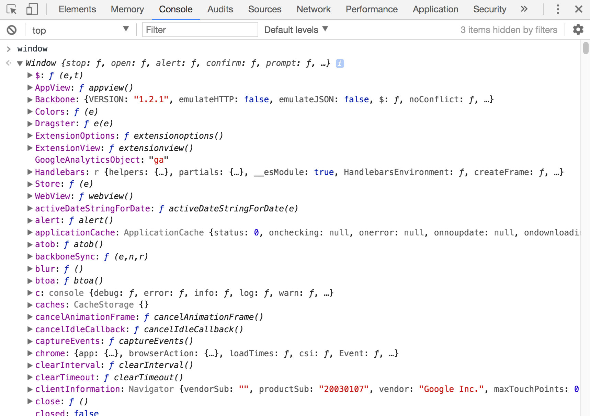

**JavaScript Runtime Engine**

JavaScript is a single threaded single concurrent language which means it can only handle one task or piece of code at a time. Let’s see this in action:

So how can we write asynchronous code with it, such as using setTimeout()?

The answer is that JavaScript runs within a browser and browsers do a lot more than just execute code. In fact, `there are four distinct parts of the browser` to consider:

1. **JavaScript runtime engine**
2. **Web APIs** provided by the browser like the `DOM`, `setTimeout`, etc.
3. **a callback queue** for events with callbacks like onClick and onLoad
4. **an event loop**

This visual from [Philip Roberts’s fantastic talk on the Event Loop](https://youtu.be/8aGhZQkoFbQ) illustrates the point nicely:

The **runtime engine** is what executes our code and each major browser has a slightly different engine under the hood.

**Web APIs** are provided to us by the browser and include methods like `setTimeout()`. If you simply type `window` in your console you can scroll through the long, long list of APIs included by default.

_These APIs are run independently, `in a separate process`, by the browser. **This is how asynchronous JavaScript happens!!!** It’s not that JavaScript itself is doing multiple things at once; instead `the browser can run multiple different processes` for us._