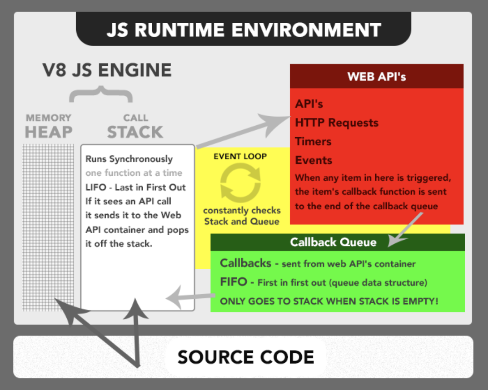

Javascript is a single-threaded programming language, meaning that JavaScript can only run one instruction at a time. 

It's synchronous, but that would make it very harmful. A good example is `alert("Hello World")`. You can't intereact with the webpage at all until you hit OK and dismiss the alert because it freezes everything up in the meanwhile.

## _*So, If JavaScript is single Threaded, How is it Asynchronous?*_

Short Answer: _These asynchronous tasks are run independently, in a separate process, by the browser. **This is how asynchronous JavaScript happens!!!** It’s not that JavaScript itself is doing multiple things at once; instead *the browser can run multiple different processes* for us._

To answer this question in more detail, we have to understand a bigger picture.

When you visit a website you do so within a web browser (Chrome, Firefox, Edge, or Safari). Each browser has **a JS Runtime Environment**. 

Think of the JS runtime environment as a big container. Within the big container are other smaller containers. 

### 1. **JS ENGINE** 
This is where JS Code is executed. (JS Engine in Chrome is V8, Firefox is spidermonkey, IE is chakra, Safari is nitro).The process of parsing here does one thing at a time on a single thread. (This is what they mean when saying JS run synchronously). The Stack is last in first out (LIFO), (Ex: putting func first, then their childs).
  
### 2. **Web APIs** 
WebAPIs provided by the browser and made available in the browser’s JS Runtime Environment.

*When _asynchronous_ tasks come (HTTP/AJAX requests or timing). They will go into call stack in JS Engine as normal functions but calling to WebAPIs as this task resided in WebAPIS. It stores these *callback functions` and does the task for us (using threading/multi processing depending on the runtime). Once it is finished, it sends the callback to callback queue.*

List of WebAPIs

### 3. **The Callback Queue** 
The Callback queue will receive callbacks from WebAPIs and store them in the FIFO data structure. 

### 4. **The Event Loop** 
The Event Loop constantly looks at the Stack and the Queue. If it sees the Stack is empty, it will notify the Queue to send over its next callback function.

*This is what they mean when they say Javascript can run asynchronously. It isn’t actually true, it just seems true. Javascript can only ever execute one function at a time, whatever is at top of the stack, it is a synchronous language. But because the Web API container can forever add callbacks to the queue (onClick event), and the queue can forever add those callbacks to the stack, we think of javascript as being asynchronous. This is really the great power of the language. Its ability to be synchronous, yet run in an asynchronous manner, like magic!*

## How is it non-blocking?
Say, when you make a call to an API and it fails or some other event is stuck, it’s still in the WebAPIs so it never goes to callback queue and hence call stack. So nothing is blocked.

Note: You can always run a multithreaded programming language in single thread, but you cant do the opposite.

Ref: 
- This visual from [Philip Roberts’s fantastic talk on the Event Loop](http://latentflip.com/loupe/) will illustrate the point nicely.
- [Javascript — single threaded, non-blocking, asynchronous, concurrent language](https://medium.com/@theflyingmantis/javascript-single-threaded-non-blocking-asynchronous-concurrent-language-ffae97c57bef)
- [The Javascript Runtime Environment](https://medium.com/@olinations/the-javascript-runtime-environment-d58fa2e60dd0)