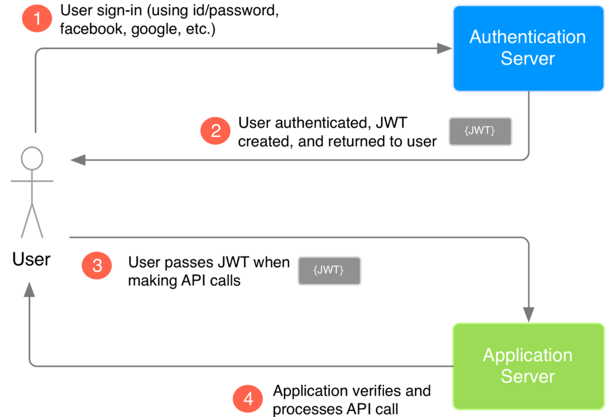

### What is JWT Authentication?

JSON Web Token (JWT) is a JSON encoded representation of a claim(s) that can be transferred between two parties. The claim is digitally signed by the issuer of the token, and the party receiving this token can later use this digital signature to prove the ownership on the claim.

_The whole idea of JWT is to create a key which can be used to authorize requests, it is not for encrypting the data, but verifying the sender and the data has not been altered along the way._

### How JWT works?



1. The user (client) logs in to the application.
2. The sever generates a token that cetifies the user identiy, and sends it to the user.
3. The user will send the token back to the server for every subsequent request.
4. The sever verifies the token and knows the request comes from a particular identity.

### How is a JWT token generated?

JWTs can be broken down into three parts: header, payload, and signature.
Each part is separated from the other by dot (.), and will follow the below structure: `Header.Payload.Signature`


**_Header_**

- The information contained in the header describes the algorithm used to generate the signature.
- HS256 is the hashing algorithm HMAC SHA-256 used to generate the signature in the above example.

**_Payload_**

- We can add additional information into this part such as userID and role.
- These data can help to reduce the number of sever calls.
- All the information inside the payload is stored in plain text. It is important not to put sensitive information here.

**_Signature_**

the steps involved in creating signature:

1. Combine the base64url encoded representations of header and payload with a dot (.)<br />
   `base64UrlEncode(header) + "." + base64UrlEncode(payload)`

2. Hash the above data with a secret-key only known to the server issuing the token. The hashing algorithm is the one described inside the header.<br />
   `hash_value = hash([base64UrlEncode(header) + "." + base64UrlEncode(payload)], secret-key)`

3. Base64Url encode the hash value obtained from the step above<br />
   `Signature = base64UrlEncode(hash_value)`

### How JWT secures your API?

Because the `secret-key` is only known to the server, only it can issue new tokens with a valid signature. Users can not forge tokens to produce a valid Signature because it requires the knowledge of the `secret-key`. Any changes of token will result in an invalid signature.

### Token Types

Since a JWT can be set to expire (be invalidated) after a particular period of time, two tokens will be considered in this application:

**Access Token** carry the necessary information to access a resource directly. In other words, when a client passes an access token to a server managing a resource, that server can use the information contained in the token to decide whether the client is authorized or not. Access tokens usually have an expiration date and are short-lived.


**Refresh Token**: A refresh token has a longer lifespan, ad is used to generate new access and refresh tokens.

When you initially received the access token, it may have included a refresh token as well as an expiration time like in the example below.

```json
{
  "access_token": "QVlqY3lNelkzWkRoaU5tSmtOVFk",
  "refresh_token": "UmpZMk5qTTVOekEyT1dKanVFN2M",
  "token_type": "bearer",
  "expires": 3600
}
```

The presence of the refresh token means that the access token will expire and you’ll be able to get a new one without the user’s interaction.

- If you make an API request and the token has expired already, you’ll get back a response indicating as such.
- You can check for this specific error message, and then make a request using the refresh token it previously received.
- The response will be a new access token, and optionally a new refresh token.


If you do not get back a new refresh token, then it means your existing refresh token will continue to work when the new access token expires.

Your application also needs to be able to handle the case when refreshing the access token also fails. At that point, you will need to prompt the user for authorization again.

### Where to store a JWT?

For a production grade application, it is highly recommended to store JWTs in an HttpOnly cookie. To achieve this, while sending the cookie generated from the backend to the frontend (client), a HttpOnly flag is sent along the cookie, instructing the browser not to display the cookie through the client-side scripts. Doing this can prevent XSS (Cross Site Scripting) attacks.

JWT can also be stored in browser local storage or session storage. Storing a JWT this way can expose it to several attacks such as XSS mentioned above, so it is generally less secure when compared to using `HttpOnly cookie technique.
