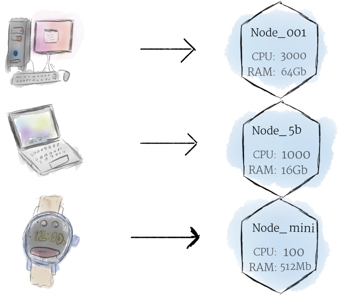
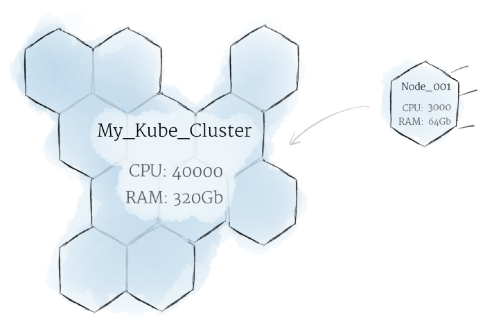
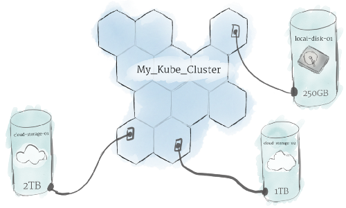
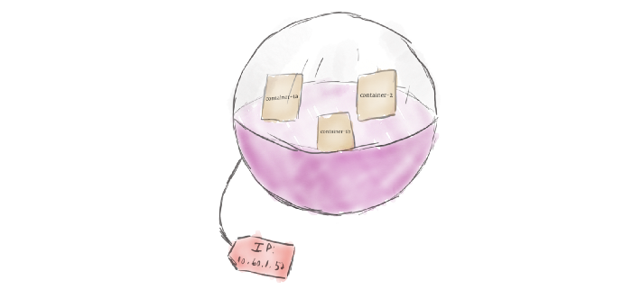
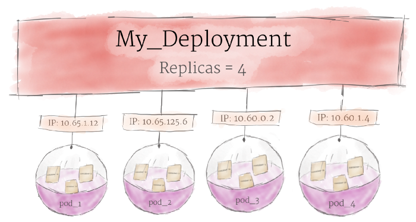
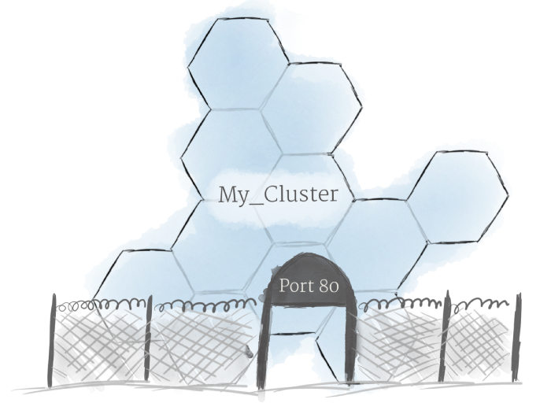

Trying to parse the official documentation of Kubernetes can be overwhelming as it comes with a steep learning curve.
Let's keep it neat and informative.

_**We can divide kubernetes into 2 parts**_
- Hardware (Nodes, Clusters, Volumes)
- Software (Containers, Pods, Deployments, Ingress)

## **Hardware**

### **_Nodes_**

*Thinking of a machine as a “node” allows us to insert a layer of abstraction, and each machine as a set of CPU and RAM resources that can be utilized*

- The smallest unit of computing hardware in Kubernetes
- Either a physical or virtual machine
- Any node can substitute any one another in a Kubernetes cluster.

### **_Cluster_**

*Although working with individual nodes can be useful, it’s not the Kubernetes way*

- Nodes pool together their resources to form a more powerful machine
- It intelligently handles distributing work to the individual nodes
- If any nodes are added or removed, the cluster will shift around work as necessary

### **_Persistent Volumes_**

*Because programs running on clusters (multiple nodes), data can’t be saved to any arbitrary place in the file system*

- To store data permanently, Kubernetes uses [Persistent Volumes](https://kubernetes.io/docs/concepts/storage/persistent-volumes/).
- While the CPU and RAM resources of all nodes are effectively pooled and managed by the cluster, persistent file storage is not.
- Persistent Volumes provide a file system that can be mounted to the cluster, without being associated with any particular node. (*This can be thought of as plugging an external hard drive in to the cluster.*)

## **Software**

### **_Containers_**

*Programs running on Kubernetes are packaged as Linux containers such as Docker.*

- Multiple programs can be added into a single container
- It’s better to have many small containers than one large one (*easier to deploy and issues are easier to diagnose*)
  

### **_Pods_**

*Kubernetes doesn’t run containers directly; instead it wraps one or more containers into a higher-level structure called a pod.*

- Any containers in the same pod will share the same resources and local network.
- Containers can easily communicate with other containers.
- Pods should remain as small as possible (*pods are scaled up and down as a unit, leading to wasted resources and an expensive bill.*)

### **_Deployments_**

*Although pods are the basic unit of computation in Kubernetes, they are not typically directly launched on a cluster. Instead, pods are usually managed by one more layer of abstraction: the deployment.*

- A deployment’s primary purpose is to declare how many replicas of a pod should be running at a time.
- If a pod dies, the deployment will automatically re-create it.
- The deployment manages pods automatically
  

### **_Ingress_**

*By default, Kubernetes provides isolation between pods and the outside world. If you want to communicate with a service running in a pod, you have to open up a channel for communication. This is referred to as ingress.*

There are multiple ways to add ingress to your cluster. The most common ways are by adding either an Ingress controller, or a LoadBalancer. 